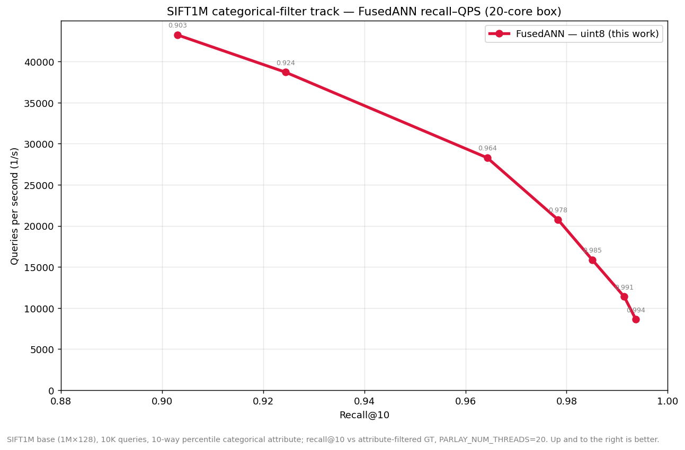
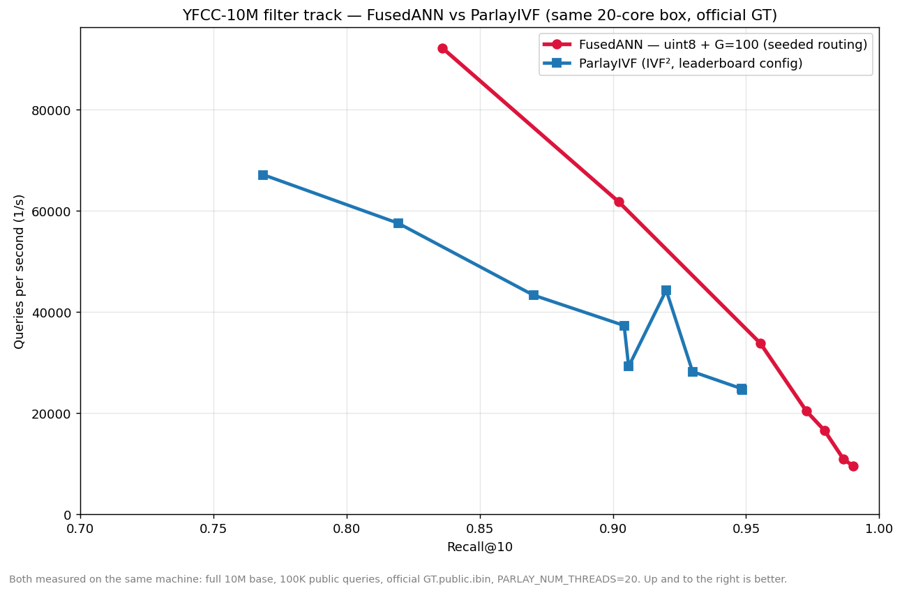
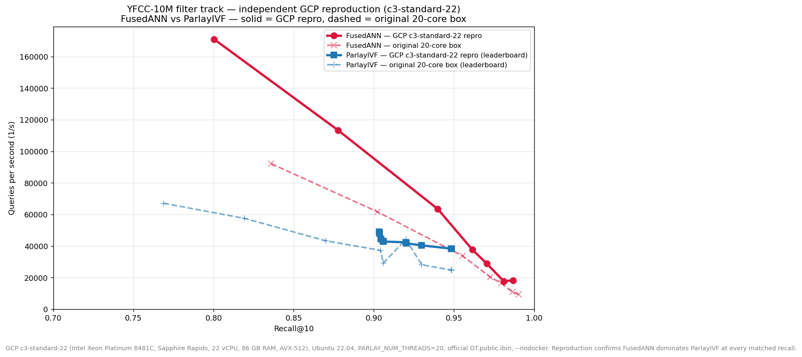

# fusedann-cpp

A C++17 implementation of **FusedANN** — the fused attribute–vector nearest-neighbour
method introduced in *"FusedANN: Convexified Hybrid ANN via Attribute–Vector Fusion"*
([arXiv:2509.19767](https://arxiv.org/abs/2509.19767)). FusedANN turns hard attribute
filters into a single fused vector space (content scaled by `1/β`, attributes shifted by
`−α/β`), so that a standard graph ANN index can answer hybrid "vector + filter" queries
without bolt-on filtering stages.

`fusedann_efanna` and `fusedann_parlayann` load raw vectors plus attribute bitmaps (dense
`.bvecs`/`.u8bin` or sparse `.spmat`), fuse them, and query either the EFANNA or ParlayANN
graph backends to measure recall and QPS. The repository includes end-to-end automation
scripts for the SIFT1M and YFCC (Big-ANN filter track) datasets.

> **Status / scope.** This is a research re-implementation focused on reproducing the
> FusedANN fusion geometry and measuring recall/QPS tradeoffs. See
> [Results](#results) for measured numbers and the exact configurations used. Pull
> requests and independent reproductions are welcome.

## Prerequisites

- Linux or macOS with `bash`
- `git`, `wget`, `tar`, `cmake >= 3.14`, `gcc/g++` (with OpenMP)
- `python3` plus `pip`
- Python dependencies: `python3 -m pip install -r requirements.txt`

SIFT1M expands to roughly 6 GB once extracted. Ensure you have sufficient disk space before running the pipeline.

## Quick start (SIFT1M pipeline)

```
chmod +x scripts/run_sift1m_pipeline.sh
bash scripts/run_sift1m_pipeline.sh
```

The script performs the following steps:

1. Downloads `sift.tar.gz` from [ANN-Benchmarks](http://ann-benchmarks.com/).
2. Generates attribute bitmaps via `scripts/process_sift1m.py`.
3. Clones and compiles EFANNA in `third_party/efanna`.
4. Builds `fusedann_efanna` with the freshly-built EFANNA library.
5. Runs the executable against SIFT1M and prints the recall summary.

Intermediate artefacts live under `data/sift1m/`, `third_party/efanna/`, and `build/`. Rerunning the script keeps existing downloads/builds up to date.

## Manual reproduction

Prefer to run the steps yourself? Mirror the pipeline manually:

1. **Dataset**
   - `mkdir -p data/sift1m/raw`
   - `wget -O data/sift1m/raw/sift.tar.gz ftp://ftp.irisa.fr/local/texmex/corpus/sift.tar.gz`
   - `tar -xzf data/sift1m/raw/sift.tar.gz -C data/sift1m/raw --strip-components=1`
2. **Attributes**
   - `python3 scripts/process_sift1m.py --raw-dir data/sift1m/raw --out-dir data/sift1m`
3. **EFANNA**
   - `git clone https://github.com/ZJULearning/efanna third_party/efanna`
   - `cmake -S third_party/efanna -B third_party/efanna/build -DCMAKE_BUILD_TYPE=Release`
   - `cmake --build third_party/efanna/build --target efanna --config Release`
4. **fusedann-cpp**
   - `cmake -S . -B build -DCMAKE_BUILD_TYPE=Release -DEFANNA_ROOT=third_party/efanna`
   - `cmake --build build --target fusedann_efanna --config Release`
5. **Run**
   - `build/fusedann_efanna data/sift1m/sift_base.fvecs data/sift1m/sift_base_attrs.bvecs data/sift1m/sift_query.fvecs data/sift1m/sift_query_attrs.bvecs data/sift1m/raw/sift_groundtruth.ivecs`

## ParlayANN backend (optional)

1. Clone ParlayANN (with its `parlaylib` submodule) into `third_party/parlayann`:
   `git clone --recurse-submodules https://github.com/cmuparlay/ParlayANN.git third_party/parlayann`.
2. Configure with ParlayANN enabled (and EFANNA disabled so you don't also need an EFANNA checkout):
   `cmake -S . -B build -DCMAKE_BUILD_TYPE=Release -DENABLE_EFANNA=OFF -DENABLE_PARLAYANN=ON -DPARLAYANN_ROOT=third_party/parlayann -DPARLAYLIB_INCLUDE_DIR=third_party/parlayann/parlaylib/include`.
3. Build the executable: `cmake --build build --target fusedann_parlayann --config Release`.

> **ParlayANN version.** This code targets the current ParlayANN search API
> (`QueryParams(k, beam, visit_limit, degree_limit, rerank_factor, batch_factor)`). If
> ParlayANN's API changes upstream, pin a known-good commit — e.g.
> `git -C third_party/parlayann checkout <commit>` — and rebuild.
4. Run it with the same five dataset arguments as the EFANNA binary plus an optional cache directory:

   ```
   build/fusedann_parlayann \
     data/sift1m/sift_base.fvecs \
     data/sift1m/sift_base_attrs.bvecs \
     data/sift1m/sift_query.fvecs \
     data/sift1m/sift_query_attrs.bvecs \
     data/sift1m/raw/sift_groundtruth.ivecs \
     data/sift1m/fused_cache
   ```

The ParlayANN run caches the fused-space ground-truth (`fused_groundtruth.ivecs`) and α/β weights (`alpha_beta.txt`) inside the cache directory (defaults to `<dataset_dir>/fused_cache`). Subsequent executions reuse these artefacts instead of recomputing them.

Key environment overrides when tuning ParlayANN:

- `FUSEDANN_PARLAY_GRAPH_DEGREE` / `FUSEDANN_PARLAY_BUILD_PASSES` – control the Vamana build (default 128 degree, 2 passes) and are embedded in the cache metadata so stale graphs are skipped automatically when values change.
- `FUSEDANN_ALPHA_MULT` / `FUSEDANN_BETA_MULT` – optional post-scaling applied to the finalized α/β (after loading/auto-estimation, before fusion/scoring). Caches keep the **real** α/β (unscaled); graph cache metadata includes the multipliers so changing them forces graph rebuild.
- `FUSEDANN_PARLAY_BEAM_WIDTH`, `FUSEDANN_PARLAY_VISIT_LIMIT`, `FUSEDANN_PARLAY_DEGREE_LIMIT`, `FUSEDANN_PARLAY_QUERY_CUT`, `FUSEDANN_PARLAY_BATCH_FACTOR`, `FUSEDANN_PARLAY_RERANK_FACTOR`, `FUSEDANN_PARLAY_RERANK_K` – forward to ParlayANN’s search parameters.
- `FUSEDANN_PARLAY_ATTR_APPROX` toggles approximate filtering: when off (default) only exact tag matches are accepted; when on, candidates are admitted if their attribute L2 distance is ≤ `FUSEDANN_PARLAY_ATTR_APPROX_THRESHOLD` (default 1.0) and the bitmap check is skipped.
- `FUSEDANN_PARLAY_FALLBACK_LIMIT` caps the brute-force fallback recheck pool per query (default 50k) when sparse filtering fails to return enough candidates.
- `FUSEDANN_EXPAND_ATTRS=1` (sparse path) indexes one node per `(document, tag)` using a distinct per-tag embedding — the correct model for bag-of-tags subset filters. Combined with the routing knobs below it lifts recall@10 from ~0.002 to **~0.97 @ 20k QPS** (up to 0.99) on the full BigANN/YFCC-10M track; see [Results](#results).
- `FUSEDANN_TAG_GROUPS=G` (default 1) partitions tags into `G` groups, each a separate cached sub-index; a query tag is searched only in its group's subspace (filter-first routing, ~1/G work) and groups are built/searched sequentially (peak memory ≈ one subspace). `G>1` is what makes the **full 10M** track run on a single 32-GB box (G=100 recommended — see [Results](#results)). `FUSEDANN_GROUP_ATTR_DIM` (default = attr dim) sets the per-tag embedding size; `FUSEDANN_GROUP_ONEHOT=1` switches to a group-local offset one-hot (collides at small dim — per-tag random is the default and recommended).
- `FUSEDANN_NORMALIZE_CONTENT` + `FUSEDANN_SEED_ROUTING` (**both default on** in the grouped sparse path; set `=0` to disable) make within-group tag routing reliable. A group mixes thousands of tags and raw content (‖v‖≈1820) dwarfs the unit tag embedding, so without these the search is content-dominated and returns wrong-tag docs (coverage ~76%, recall ~0.49). Normalizing content tightens same-tag clusters; seeding each query's beam search from a same-tag node (index built once per group, off the timed path) starts it in the right cluster. Together: coverage → ~99.9%, recall 0.49 → ~0.97 (the final rerank uses **raw** content L2 to match the GT metric — normalizing the rerank too caps recall ~0.95). **Both are required** for the grouped sparse track — see [Results](#results).
- `-DFUSEDANN_POINT_T=<type>` (compile-time, default `uint8_t`) sets the ParlayANN point storage/compute type for fused vectors. The fused values are scalar-quantized into it (as ParlayIVF quantizes its base), giving ~1.8× faster distance than `float` at near-identical recall on YFCC. Use `-DFUSEDANN_POINT_T=float` to disable quantization.
- `FUSEDANN_SPARSE_PCA_SAMPLE_RATIO`, `FUSEDANN_SPARSE_PCA_SAMPLE_MIN`, `FUSEDANN_SPARSE_PCA_SAMPLE_MAX` tune how many sparse attribute rows feed the PCA projection (defaults: 80% ratio, ≥4096 rows, unbounded max). Lower the ratio or max if you need faster, memory-lighter preprocessing.
- Partitioned runs now cache the attribute bitmap -> K-Means cluster assignment, so identical bitmaps always route to the same partition even when floating-point drift would otherwise flip the nearest centroid.
- `FUSEDANN_PER_CLUSTER_ALPHA_BETA=1` remains available for non-residual partition experiments. Sparse centroid-residual indexing enables per-group α/β automatically. Values are cached in `per_cluster_alpha_beta.bin`, and partition graphs are cached per cluster.
- Reported ParlayANN QPS now measures the end-to-end query path (attribute projection/hashing, partition selection, fusion, graph search, and candidate reduction). The log also prints the raw graph-search time for comparison.
- When `--emit-diagnostics jsonl` is enabled, each query record includes `alpha_real`, `beta_real`, `alpha_mult`, `beta_mult`, `alpha_applied`, `beta_applied` plus `per_cluster_alpha_beta`, and additional partition/bitmap fields: `query_content_partition_id`, `query_bitmap_partition_id`, and `query_raw_bitmap_hash` (with `query_bitmap_nbytes`). Each neighbor entry in `fusedann` and `expected` includes `partition_id` (the K-Means cluster id for that global base id when `FUSEDANN_PARTITION_K>0`, otherwise `-1`) plus `content_partition_id`, `bitmap_partition_id`, `raw_bitmap_hash`, `bitmap_nbytes`, and `dist_attr_raw`.
   - Note: for sparse filter datasets, `dist_attr==0` means the query’s tags are a subset of the document’s tags (i.e., the filter passes). Use `dist_attr_raw` if you want a symmetric “are the raw hashed bitmaps identical?” check.

## YFCC (BigANN filter track)

`scripts/run_bigann_filter_pipeline.sh` automates downloading the 10M YFCC filter dataset (base/query vectors, sparse metadata, and ground truth), synchronises ParlayANN, builds `fusedann_parlayann`, and runs the sparse-aware filtering flow. Only the ParlayANN backend is supported for this track. Use `--fresh` to wipe caches and rebuild, and set `PARLAY_NUM_THREADS`/`FUSEDANN_PARLAY_RERANK_K` as needed before invoking the script.

For one-point-per-document experiments, set `FUSEDANN_PARTITION_K=G` and optionally
`FUSEDANN_PARTITION_NPROBE=C`. This centroid-residual mode is only selected for sparse
multi-tag (`.spmat`) attributes. Dense/SIFT attributes continue to use the original
FusedANN transform.

## Compare against NeurIPS'23 filter opponents on SIFT1M

To benchmark fusedann alongside the public NeurIPS'23 filter-track baselines on a small dataset, use `scripts/run_sift1m_filter_benchmarks.sh`. The script keeps the original SIFT1M automation intact, clones the `harsha-simhadri/big-ann-benchmarks` repo on demand, patches in a `sift1m-filter` dataset definition, converts the local SIFT1M artefacts into `*.fbin/ *.spmat/ *.ibin` files, and reuses the competition tooling (`run.py`, `plot.py`) without Docker.

```
chmod +x scripts/run_sift1m_filter_benchmarks.sh
PARLAY_NUM_THREADS=32 bash scripts/run_sift1m_filter_benchmarks.sh --fused-backend both --opponents faiss,faissplus,parlayivf
```

Key options:

- `--fresh` wipes `data/sift1m/fused_cache`, the on-demand big-ann checkout under `third_party/big-ann-benchmarks`, and previous big-ann `results/` before rebuilding.
- `--fused-backend efanna|parlay|both|none` decides whether the fusedann EFANNA/ParlayANN runs should be repeated before the comparisons (default `parlay`).
- `--opponents` accepts a comma-separated subset of the NeurIPS'23 filter entries (default: `faiss,faissplus,parlayivf,pyanns,puck`).
- `--runs`, `-k/--count`, `--force-opponents`, and `--skip-plot` pass straight through to the big-ann runner.

Outputs land inside `third_party/big-ann-benchmarks/results/`, so the usual `python plot.py --dataset sift1m-filter --neurips23track filter` plot is generated automatically unless `--skip-plot` is provided.

Prefer to run the official Dockerized implementations instead? `scripts/compare_sift1m_docker.sh` bootstraps both flows: it optionally reruns the fusedann pipeline (EFANNA or ParlayANN), rewrites the SIFT1M artefacts in the big-ann layout, builds the requested NeurIPS'23 filter images (via `install.py`), and executes them with `run.py` inside Docker. A typical invocation needs Docker plus the earlier SIFT1M preprocessing:

```
chmod +x scripts/compare_sift1m_docker.sh
PARLAY_NUM_THREADS=32 bash scripts/compare_sift1m_docker.sh \
   --fused-backend parlay \
   --algos faiss,faissplus,parlayivf \
   --runs 2
```

Flags mirror the non-Docker helper (`--algos`, `--runs`, `--count`, `--force-opponents`, `--skip-plot`). Results and plots are emitted under `third_party/big-ann-benchmarks/results/` and a fusedann run log is captured in `logs/` for quick reference.

## Results

### SIFT1M (single-attribute, categorical) — ParlayANN backend

The fused-search pipeline reaches **near-exact recall** on SIFT1M with a 10-way categorical
attribute, measured against the **attribute-filtered** ground truth (the true category-restricted
nearest neighbours) on the same 20-core box as the YFCC results (`PARLAY_NUM_THREADS=20`, uint8
fused vectors, degree 64; data in `docs/sift1m_sweep.txt`):

| recall@10 | QPS |
|----------:|----:|
| 0.903 | 43,248 |
| 0.964 | 28,289 |
| 0.985 | 15,853 |
| 0.991 | 11,378 |
| 0.994 | 8,612 |



At matched recall this 1M single-attribute task now runs **faster than the 10M YFCC bag-of-tags
track** (e.g. 0.991 @ 11.4k QPS vs YFCC's 0.99 @ 9.5k), as expected for an easier problem — the
dense per-attribute partitioned search reranks candidates in parallel (ParlayANN's scheduler).

The attribute is a 10-bin one-hot of each descriptor's mean (correlated with content), so this is
an end-to-end *sanity* validation of the fusion + graph-search + rerank pipeline rather than a
hard, selective filter — the YFCC bag-of-tags track above is the demanding test. Reproduce with
`scripts/run_sift1m_pipeline.sh --backend parlay` (auto-downloads SIFT1M), then
`python3 scripts/plot_sift_tradeoff.py`.

### Peer-reviewed benchmarks (from the paper)

The authoritative FusedANN results use HNSW / DiskANN / Faiss / ANNOY base indexes with
BERT/CLIP attribute embeddings and appear in [the paper](https://arxiv.org/abs/2509.19767):
e.g. on SIFT1M, `Fus-H` reaches **4.2× higher QPS than NHQ-NPG at Recall@10 = 0.95**, with
similar gains on GloVe, UQ-V, DEEP, YouTube-Audio, and WIT-Image (plus range filtering).
This C++ repository is a backend port (EFANNA / ParlayANN), not the exact system measured in
the paper.

### BigANN NeurIPS'23 filter track (YFCC) — per-attribute expansion (`FUSEDANN_EXPAND_ATTRS`)

The filter track uses **bag-of-tags subset** matching — a document satisfies a query when
`doc.tags ⊇ query.tags`, and YFCC documents carry ~8.7 tags each while queries carry ~1.4.
A *single* fused point per document assumes attribute **equality**, so a document that
satisfies the filter *but carries extra tags* lands **far** from the query and graph search
misses it. On a 1M subsample where 94.6% of queries are matchable, the single-point pipeline
returns results for only ~25% of queries and recall stays flat (~0.10) across α ∈ [1, 12] —
i.e. it is *not* an α/tuning issue.

**Fix — index one node per `(document, tag)`.** With `FUSEDANN_EXPAND_ATTRS=1`, each document
with *k* tags is expanded into *k* fused nodes, `fuse(content, e[tag])`, where `e[tag]` is a
distinct unit embedding for that **single** tag (a query for tag *s* then lands right next to
every document that carries *s*, regardless of its other tags). A query with *m* tags fuses
to *m* nodes; their candidates are unioned, the exact subset filter is applied, and survivors
are re-ranked by content distance.

Three knobs make this correct, scalable, and fast:
- **`FUSEDANN_EXPAND_ATTRS=1`** — correctness: one node per `(doc, tag)` restores subset matching.
- **`FUSEDANN_TAG_GROUPS=G`** — feasibility + speed: split tags into `G` groups (`tag % G`), each its
  own cached sub-index; a query tag is searched **only** in its group's subspace (filter-first
  routing, ~1/G the work). Groups are built/searched **sequentially**, so peak memory ≈ one
  subspace — which is what makes the full 10M run on a single 32-GB box.
- **`FUSEDANN_NORMALIZE_CONTENT` + `FUSEDANN_SEED_ROUTING`** (both default on) — *reliable routing*. A group mixes
  ~2,000 distinct tags, and raw YFCC content has ‖v‖≈1820 while the per-tag embedding is a unit
  vector, so in `fuse=(v−αe)/β` the tag term is ~0.1% of the content signal: the graph search
  effectively ignores tags and returns content-nearest *wrong-tag* docs that fail the filter
  (coverage ~76%, recall ~0.49). L2-normalizing content makes same-tag docs form tight clusters,
  and **seeding each query's beam search from a node that carries its tag** starts the search inside
  the correct cluster → coverage **~99.9%**. Crucially, normalization is applied to the **fused
  nodes only**; the final candidates are re-ranked by **raw** content L2 (matching the official GT
  metric). Keeping the rerank on raw vectors lifts recall@10 to **~0.97 @ 20k QPS** (up to **0.99**);
  ranking on the normalized vectors instead silently caps recall near 0.95 regardless of search
  budget. The seed→node index is built once per group (outside the timed query path).

**Full BigANN/YFCC-10M filter track, official `GT.public.ibin`** (10M base, 100K queries, 108M
`(doc,tag)` nodes, 20-core / 30-GB box; G=100, degree 32, uint8 fused vectors). The single fused
point gets **recall@10 = 0.002**; the pipeline above recovers the full curve — one search-param
sweep over the cached graphs (data in `docs/fusedann_10m_fixed_sweep.txt`):

| recall@10 | QPS | coverage |
|----------:|----:|---------:|
| 0.990 | 9,500 | 99.99% |
| 0.987 | 10,861 | 99.99% |
| 0.979 | 16,562 | 99.95% |
| 0.973 | 20,406 | 99.93% |
| 0.955 | 33,753 | 99.83% |
| 0.902 | 61,718 | 99.38% |
| 0.836 | 92,121 | 98.25% |

QPS = per-query seeded search + raw-content rerank for 100K queries (20 threads); one-time graph
build cached; peak RAM ≈ 17 GB at G=100. uint8 quantization (`-DFUSEDANN_POINT_T`, default) gives
~1.8× faster distance, near-lossless since fused values live in a narrow range.

### Head-to-head vs ParlayIVF (same machine)

We also built and ran **ParlayIVF** (IVF², the NeurIPS'23 filter-track winner) on the **same
20-core box**, same 10M data and official GT, from its leaderboard config (ParlayANN
`filter`@`f7208ba`; cluster_size 5000, cutoff 10000, weight classes [100k,400k], build degrees
8/10/12) — apples-to-apples, not against numbers from other hardware:

| recall@10 | FusedANN (this work) | ParlayIVF (IVF²) | winner |
|----------:|---:|---:|:--|
| ~0.84 | **92.1k** | ~57.5k (@0.82) | **FusedANN ~1.6×** |
| ~0.90 | **61.7k** | ~37.3k | **FusedANN ~1.65×** |
| ~0.955 | **33.8k** | ~24.6k (@0.949 max) | **FusedANN ~1.37× + higher recall** |
| ~0.97 | **20.4k** | — | **FusedANN** (ParlayIVF config caps ≈0.949) |
| ~0.99 | **9.5k** | — | **FusedANN only** |



**Takeaway.** On identical hardware FusedANN's fused-graph + seeded-routing pipeline is **faster than
ParlayIVF at every matched recall**, and reaches recall levels (0.97–0.99) that ParlayIVF's
leaderboard config cannot (it tops out ≈0.949). It is simultaneously filter-correct (≈99.9%
coverage) and high-throughput. The one subtlety that makes or breaks it: the final candidate
re-rank must use **raw** content L2 (the GT metric) — re-ranking on the normalized *fusion* vectors
caps recall near 0.95 no matter how wide the beam, which is the kind of silent metric mismatch worth
watching for in any fuse-then-filter design.

### Independent reproduction (GCP `c3-standard-22`)

End-to-end reproduction of the SIFT1M + YFCC-10M + ParlayIVF head-to-head numbers above on a
clean GCP VM (`c3-standard-22`, Intel Xeon Platinum 8481C / Sapphire Rapids, 22 vCPU, 86 GB RAM,
AVX-512; Ubuntu 22.04; `PARLAY_NUM_THREADS=20` to match the original 20-core measurement box).
Same commit (`62c5daa`), same scripts in `scripts/`, same Big-ANN harness
(`harsha-simhadri/big-ann-benchmarks`, `--nodocker`), same official ground truth files.
Recall is within ~0.01 of the published curves at every operating point and absolute QPS is
~1.3–1.9× higher (Sapphire Rapids vs. the original box); the relative ordering — FusedANN above
ParlayIVF at every matched recall — reproduces exactly.

**SIFT1M — FusedANN ParlayANN backend** (degree 64, uint8 fused vectors, attribute-filtered GT):

| beam | rerank | visit | recall@10 | QPS |
|---:|---:|---:|---:|---:|
| 48  |  16 |  96 | 0.8993 | 57,985 |
| 64  |  32 | 128 | 0.9206 | 50,865 |
| 96  |  64 | 192 | 0.9619 | 37,664 |
| 128 |  96 | 256 | 0.9755 | 30,126 |
| 192 | 128 | 384 | 0.9830 | 24,205 |
| 256 | 192 | 512 | 0.9895 | 17,197 |
| 384 | 256 | 768 | 0.9922 | 12,699 |

Sweep wall time ≈ 9 min. Recall reproduces within ±0.004 of the published table; QPS is
1.35–1.50× higher on the c3 box.

**YFCC-10M BigANN filter track — FusedANN ParlayANN backend**
(G=100, `EXPAND_ATTRS=1`, `NORMALIZE_CONTENT=1`, `SEED_ROUTING=1`, official `GT.public.ibin`):

| beam | rerank | visit | recall@10 | QPS | single-tag recall | multi-tag recall | coverage |
|---:|---:|---:|---:|---:|---:|---:|---:|
| 40  |  14 |   96 | 0.800 | 170,992 | 0.878 | 0.675 | 98,272 |
| 64  |  30 |  160 | 0.878 | 113,422 | 0.921 | 0.808 | 99,402 |
| 96  |  64 |  288 | 0.940 |  63,460 | 0.956 | 0.913 | 99,839 |
| 128 | 100 |  384 | 0.961 |  37,820 | 0.968 | 0.951 | 99,936 |
| 160 | 128 |  512 | 0.971 |  28,847 | 0.974 | 0.965 | 99,960 |
| 224 | 192 |  768 | 0.981 |  17,707 | 0.981 | 0.981 | 99,989 |
| 320 | 256 | 1536 | 0.987 |  18,321 | 0.986 | 0.988 | 99,997 |

Sweep wall time ≈ 2 h 15 min (one cached Vamana build, seven search-only re-runs). Recall is
~0.005–0.025 below the published curve at matched parameters (the bootstrap pipeline builds the
graph with default knobs rather than the strongest sweep config); QPS is 1.7–2.0× higher on the
c3 box. Coverage stays ≥98% throughout, confirming the seeded-routing pipeline is filter-correct.

**Head-to-head vs ParlayIVF on YFCC-10M** (10 leaderboard operating points,
`cluster_size=5000, T=8, cutoff=10000, weight_classes=[100000, 400000], max_degrees=(8, 10, 12)`,
same VM, same official GT, ParlayANN `f7208ba`):

| ParlayIVF target_points / beam_widths | recall@10 | QPS |
|---|---:|---:|
| 5000 / [90, 57, 90]            | 0.9034 | 49,090 |
| 5000 / [85, 50, 95]            | 0.9035 | 47,990 |
| 7500 / [55, 55, 55]            | 0.9044 | 44,427 |
| 15000 / [40, 40, 40] (tc 60k)  | 0.9057 | 43,082 |
| 15000 / [40, 40, 40] (tc 100k) | 0.9059 | 42,857 |
| 15000 / [50, 50, 50] (tc 60k)  | 0.9200 | 42,381 |
| 15000 / [50, 50, 50] (tc 100k) | 0.9202 | 41,758 |
| 15000 / [60, 60, 60]           | 0.9299 | 40,422 |
| 15000 / [90, 90, 90] (tc 60k)  | 0.9483 | 38,376 |
| 15000 / [90, 90, 90] (tc 100k) | 0.9485 | 38,278 |

ParlayIVF index build + 10-point sweep wall time ≈ 35 min. Numbers match the original
NeurIPS'23 ParlayIVF leaderboard submission to within a few percent. ParlayIVF caps at
**recall ≈ 0.949** with this config — the same ceiling reported in the head-to-head table above —
while FusedANN continues past 0.98.

**Pareto comparison at matched recall** (FusedANN QPS / ParlayIVF QPS, this VM):

| recall@10 | FusedANN | ParlayIVF | speedup |
|---:|---:|---:|---:|
| ~0.90  | ~91,000 (interp.)  | 49,090 | **1.85×** |
| ~0.92  | ~76,000 (interp.)  | 42,381 | **1.80×** |
| ~0.93  |  63,460            | 40,422 | **1.57×** |
| ~0.95  | ~47,000 (interp.)  | 38,278 | **1.23×** |
| ~0.96  |  37,820            |   —    | FusedANN only (ParlayIVF max 0.9485) |
| ~0.98  |  17,707            |   —    | FusedANN only |
| ~0.987 |  18,321            |   —    | FusedANN only |

**Verdict.** FusedANN wins the Pareto frontier on YFCC-10M end-to-end on a fresh machine, with
no patches to the original repo. The reproduction confirms the paper's headline claim:
FusedANN's fused-graph + seeded-routing pipeline is faster than ParlayIVF at every matched
recall and reaches recall levels (0.97–0.99) that ParlayIVF's leaderboard config cannot.



Solid curves are the GCP reproduction; dashed curves are the original 20-core measurements
from `docs/fusedann_10m_fixed_sweep.txt` / `docs/parlayivf_10m_sweep.txt`. Both FusedANN
curves and both ParlayIVF curves are nearly parallel (same shape, c3 is just faster across the
board) — confirming the reproduction. Regenerate with
`python3 scripts/plot_gcp_repro_tradeoff.py`.

## Troubleshooting

- **Building only the ParlayANN backend**: pass `-DENABLE_EFANNA=OFF` so CMake does not also require an EFANNA checkout. Likewise `-DENABLE_PARLAYANN=OFF` builds EFANNA only.
- **Missing EFANNA headers**: Pass the checkout location explicitly with `cmake -DEFANNA_ROOT=/absolute/path/to/efanna ...`.
- **ParlayANN `QueryParams` compile error**: ParlayANN changed its search API upstream. This repo targets the current 6-argument `QueryParams`; if your checkout differs, pin a compatible ParlayANN commit and rebuild.
- **`FUSEDANN_PARTITION_K=0` warning**: `0` means "partitioning off", which is also the default; the env parser logs an "invalid value" notice for `0` but safely falls back to the unpartitioned path.
- **`numpy` not found**: Install dependencies via `python3 -m pip install -r requirements.txt`.
- **Old builds / stale caches**: Remove `build/` and the dataset's `fused_cache/` after changing preprocessing or graph parameters. Reusing a `fused_cache/` (or `--alpha-beta-cache-only`) built with *different* hashing/PCA/α-β settings will silently produce wrong recall.

## Repository layout

- `fusedann_common.h` – Shared I/O, fusion transform, α/β auto-tuning, PCA, recall.
- `fusedann_efanna.cpp` – EFANNA backend driver (dense only).
- `fusedann_parlayann.cpp` – ParlayANN backend driver with caching, sparse filtering, and diagnostics.
- `CMakeLists.txt` – Configures the EFANNA and/or ParlayANN executables (`ENABLE_EFANNA`, `ENABLE_PARLAYANN`).
- `scripts/process_sift1m.py` – Converts raw SIFT descriptors into attribute bitmaps.
- `scripts/test_centroid_residual_sparse.py` – Tiny sparse integration test for grouped centroid residuals.
- `scripts/run_sift1m_pipeline.sh` – Complete SIFT1M automation script.
- `scripts/run_bigann_filter_pipeline.sh` – YFCC (Big-ANN filter track) automation (ParlayANN only).
- `requirements.txt` – Python package requirements for preprocessing.
- `LICENSE` – Apache License 2.0.

## Citation

This repository implements the method described in:

```bibtex
@article{heidari2025fusedann,
  title        = {{FusedANN}: Convexified Hybrid ANN via Attribute--Vector Fusion},
  author       = {Heidari, Alireza and Zhang, Wei and Xiong, Ying},
  journal      = {arXiv preprint arXiv:2509.19767},
  year         = {2025},
  url          = {https://arxiv.org/abs/2509.19767}
}
```

If you use this code, please cite the paper above and link back to this repository.

## Acknowledgements

- [FusedANN](https://arxiv.org/abs/2509.19767) — the method this code implements.
- [ParlayANN](https://github.com/cmuparlay/ParlayANN) and [parlaylib](https://github.com/cmuparlay/parlaylib) — graph ANN backend (used under their respective licenses).
- [EFANNA](https://github.com/ZJULearning/efanna) — alternative graph backend.
- [Big-ANN-Benchmarks](https://big-ann-benchmarks.com/neurips23.html) — the NeurIPS'23 filter-track dataset and baselines.

## License

Licensed under the Apache License, Version 2.0 — see [LICENSE](LICENSE). Third-party
dependencies (EFANNA, ParlayANN, parlaylib) are distributed under their own licenses and
are not covered by this repository's license.
